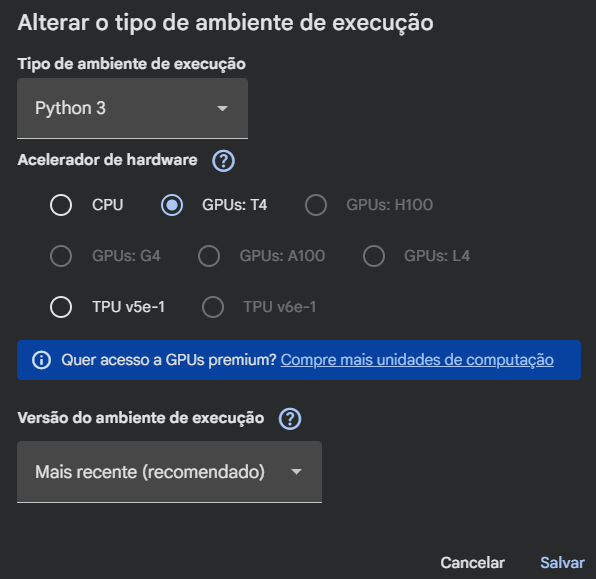
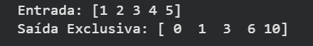

# Redu-es-e-prefix-sum-scan-paralelos

# Redução e Prefix-Sum (Scan) Paralelos em CUDA


Repositório dedicado à implementação e análise de algoritmos paralelos em GPU usando **Python e Numba CUDA**. Este projeto explora o desenvolvimento de algoritmos de Redução (Soma, Máximo, Mínimo) e Prefix-Sum/Scan (Hillis-Steele e Blelloch), partindo de abordagens ingênuas até versões otimizadas sem divergência de *warp*.

## 👥 Integrantes da Equipe
* **Gustavo** - Implementação CUDA e Otimizações (Fase 2)
* **Olívier** - [Adicionar responsabilidade]
* **Ruan** - [Adicionar responsabilidade]

---

## Objetivo do Projeto
O objetivo principal é demonstrar o ganho de desempenho (Speedup) e as nuances arquiteturais da programação em GPU comparadas à CPU. O projeto implementa:
1. **Baseline em CPU:** Execução sequencial para validação de corretude.
2. **Redução Ingênua (GPU):** Algoritmo com divergência de *warp*, demonstrando os gargalos da arquitetura.
3. **Redução Otimizada em Árvore (GPU):** Uso eficiente de memória compartilhada e reestruturação de índices para evitar ociosidade dos SMs (Streaming Multiprocessors).
4. **Scan Inclusivo (Hillis-Steele):** Implementação paralela em GPU utilizando *double buffering* (ping-pong).
5. **Scan Exclusivo (Blelloch):** Abordagem *work-efficient* com fases de *Up-Sweep* e *Down-Sweep*.

---

## 📂 Estrutura do Repositório

* `src/cpu/baseline.py`: Algoritmos sequenciais (gabaritoS) executados na CPU.
* `src/cuda/reduction_naive.py`: Redução com divergência de warp (Soma, Máx, Mín).
* `src/cuda/reduction_optimized.py`: Redução sem divergência usando memória compartilhada.
* `src/cuda/hillis_steele.py`: Algoritmo de Scan Inclusivo.
* `src/cuda/blelloch.py`: Algoritmo de Scan Exclusivo (*work-efficient*).
* `notebooks/reducao_scan_cuda.ipynb`: Notebook principal com testes e cálculos de Speedup.
* `resultados/`: Tabelas e métricas de desempenho.
* `USO_DE_IA.md`: Documentação técnica sobre o uso de ferramentas de IA na depuração do código.

---

## ⚙️ Instruções de Execução

### Opção 1: Execução Local (VS Code)
**Pré-requisitos:** Placa de vídeo NVIDIA, CUDA Toolkit instalado, Python 3.x.
1. Ative o ambiente virtual do projeto: `source .venv/bin/activate` (Linux/Mac) ou `.venv\Scripts\activate` (Windows).
2. Instale as dependências: `pip install numba numpy`
3. Navegue até a pasta `src/cuda/` e execute o script desejado, por exemplo:
   ```bash
   python hillis_steele.py

### Opção 2: Execução Virtual (Colab)

1. Abra o ambiente online

   [](https://colab.research.google.com/)

2. Escolha a seção `arquivo`, selecione `Fazer upload de notebook` e vá em `procurar`.

3. procure pelo diretório `notebooks` dentro do projeto.
* Estrutura do diretório:
   `/Redu-es-e-prefix-sum-scan-paralelos/notebooks`

4. Selecione o arquivo `.ipynb` desejado.
* arquivos disponíveis:

  - `reduction_naive.py`: Redução com divergência de warp (Soma, Máx, Mín).
   
   - `reduction_optimized.py`: Redução sem divergência usando memória compartilhada.
  
   - `hillis_steele.py`: Algoritmo de Scan Inclusivo.
   
  -  `blelloch.py`: Algoritmo de Scan Exclusivo (*work-efficient*).


5. Na seção `Ambiente de execução`, selecione `Alterar o tipo de ambiente de execução`.

6. Escolha a opção `GPUs: t4` e selecione `Python 3` em  `Tipo de ambiente de execução`.

    

7. clique em `Salvar`.

**Com o código código aberto, compile utilizando o botão ao lado esquerdo.**

**Exemplo de saída compilando o arquivo `blelloch.ipynb`**.



